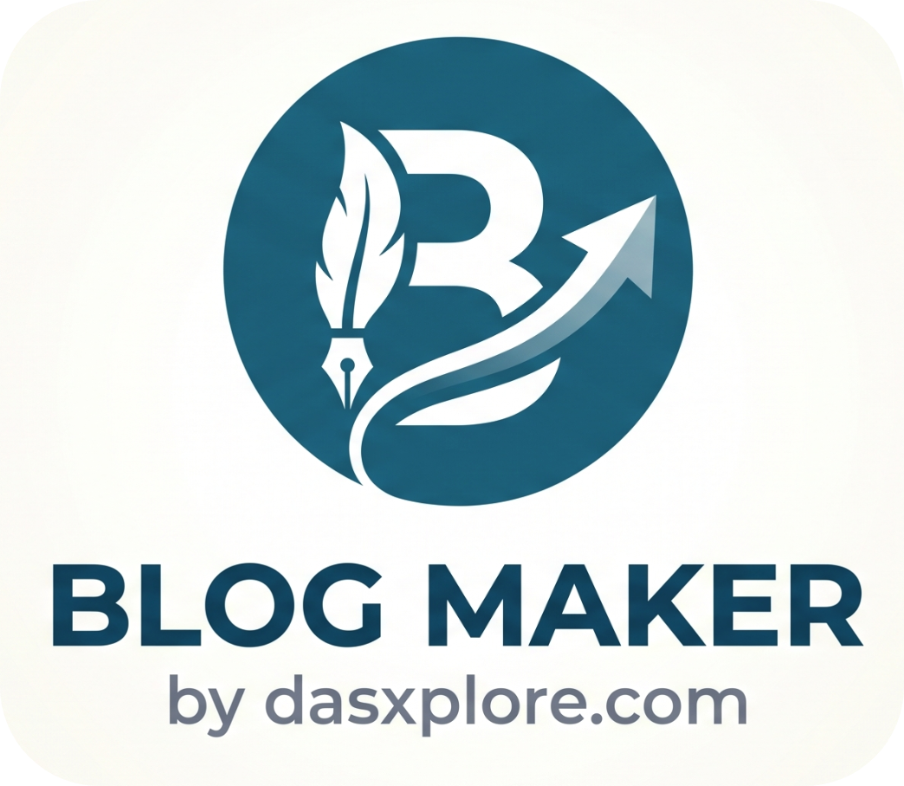

<p align="center"></p>

# 🪶 Blog Maker
WYSIWYG blog creator based on [summernote](https://summernote.org/). We can edit existing blogs too or we can create new blogs. Also supports meta tag manipulation like `keywords` etc.

## 💰 Sponsor Me
You can buy me a coffee via [this link](https://www.paypal.com/paypalme/soomnathsdas) or tap on below image. Thank you 🙏. <br>
<a href="https://www.paypal.com/paypalme/soomnathsdas"></a>

## 📽️ Demo
You can click on the below Image or this [Youtube Link](https://www.youtube.com/watch?v=KifuF36ZSkw) to see the demo. Please let me know in the comments, how do you feel about this App. <br>

<a href="https://youtu.be/KifuF36ZSkw">
  
</a>


## 💻 Quickstart Guide
It is easy and quick to setup. All you need is `python` and `git` installed on your system.

### 🐍 Run with Python
You can downlaod python from the [official website](https://www.python.org/downloads/)

1. Clone the repo & run your app
```bash
git clone https://github.com/dasxplore/blog-maker.git
cd blog-maker/app
python3 -m venv .env

# On non-Windows
source .env/bin/activate

# On Windows
bash # if you have git instaled, the git bash will open in your terminal
source .env/Scripts/activate

# install the dependencies
pip install -r requirements.txt

# Then run the app
python app.py # it will use the default paths as shown in below table.
```

2. Open your browser and type below adress. Then start creating the blogs.
```
http://localhost:5000/
```

#### Maintaining the JSON metadata
We are using this [json format](./website/assets/data/blogs/blogs.json) to create blogs with proper details and directory structure. In order to add new blogs, first add them using the given template and the run the app. Then app can directly save using proper structure and details.

### 🎛️ Arguments for the app
All default paths are related from [app](./app/) directory. You can try `python app.py --help` to get the details.
```bash
usage: app.py [--host HOST] [--port PORT] [--json JSON] [--html_dir HTML_DIR] [--domain DOMAIN] [--debug]
```

| Argument | Description | Type | Default | Required |
| :------- | :---------- | :--- | :------ | :------: |
| `--host` | You may use `0.0.0.0` if you want the app to be accessible from your network | `str` | `127.0.0.1` | no |
| `--port` | Port number to run your app | `int` | `5000` | no |
| `--json` | Path to your blog JSON (metadata) file. Sample [file](./website/assets/data/blogs/blogs.json) | `str` | `../website/assets/data/blogs/blogs.json` | no |
| `--html_dir` | The directory path where your blogs will be created and it needs to have the [template](./website/blogs/templates/) directory (see below for more details) | `str` | `../website/blogs` | no |
| `--domain` | The domain url, it is used in meta tags | `str` | `https://dasxplore.com` | no |
| `--debug` | Pass this argument to enable flask debug | `none` | | no |

### 🧾 Blog Template Customisation

1. You need to have the following directory structure for the `--html_dir` i.e. the `blog` directory where the `template` folder with `blog.html` should exist. Here is our [template](./website/blogs/templates/) . You can follow the same structure and have your own template. The blogs will also be created under the selected directory.

```bash
.
├── assets
│   ├── css
│   │   └── main.css
│   └── data
│       └── blogs
│           └── blogs.json
├── blogs
│   └── templates
│       └── blog.html
└── index.html
```

2. You can have your own template for the blogs including your navbar, footer or any other sections. All you need is a `div` tag with ID `blogContent` having `{{ blog_html }}` written inside and our app will add the created/updated blog under it. Here is our [html file](./website/blogs/templates/blog.html). Your template can have something like:

```html
<section {{ pagefind }} class="your-class">
  <div id="blogContent" class="container">
    {{ blog_html }}
  </div>
</section>
```

### 📚 Tech stack used
We have used below stacks:

#### App Frontend
1. [Bootstrap 5](https://getbootstrap.com/docs/5.3/getting-started/introduction/)
2. [JQuery](https://jquery.com/)
3. [Bootstrap Icons](https://icons.getbootstrap.com/)
4. [summernote](https://summernote.org/)

#### App Backend
1. [flask](https://flask.palletsprojects.com/en/stable/)
2. [Jinja2](https://pypi.org/project/Jinja2/)
3. [BeautifulSoup 4](https://pypi.org/project/beautifulsoup4/)

## 🤝 Collaboration
This is licensed under `MIT license`, you may build something more powerful and having more developers will surely help this project a lot. Hoping to hear from you.
